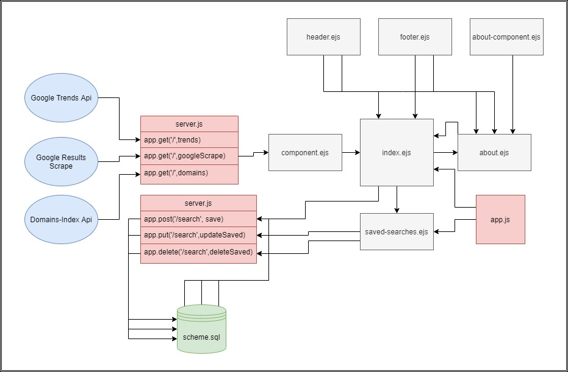
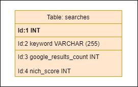

# Novus Ideam

## Authors:
- Brendan Smith
- Dar-Ci Calhoun
- Jason Dormier
- Glenn Clark

## Overview
The user would like to generate ideas to start a small business but doesn’t know what their idea should be. The user would like to use a website to generate ideas based on the search volume of a given topic and compare it to the number of solutions that are currently provided. 

## Setup Instructions (for local hosting using PostgreSQL)
* `npm install` to install all required packages.
* create `.env` file in your local directory. Set `PORT` variable. 
* Set up psql database:
    * `CREATE DATABASE novus_ideam`
    * `psql novus_ideam -f schema.sql`
    * set `DATABASE_URL` to local database route in `.env`

## Architecture
<!-- TODO -->
## Change Log
<!-- TODO -->
## Credits and Collaborations
- Chance Harmon (TA)
- Skyler Burger (TA)
- Nico Ryan (TA)
- Regex101.com
- https://www.youtube.com/watch?v=4q9CNtwdawA
- https://stackoverflow.com/questions/37576685/using-async-await-with-a-foreach-loop#37576787

## Domain Model

## Database ERD
